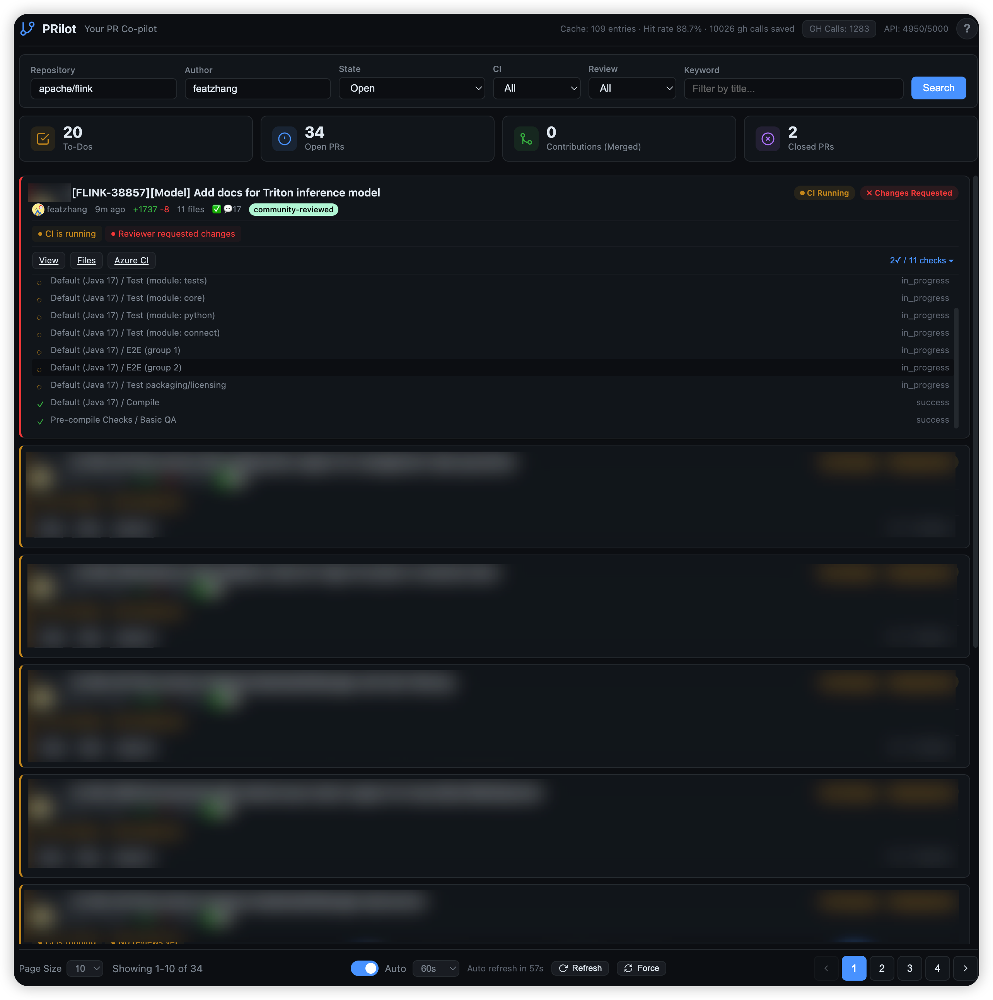

# PR Manager

A web-based dashboard for managing open-source project Pull Requests, using [Apache Flink](https://github.com/apache/flink) as the default example.


## Features

- **PR List Dashboard** — View all PRs with status, CI results, review state, merge conflicts, and actionable to-dos at a glance.
- **Stats Overview** — Open PR count, contribution (merged) count, and closed count.
- **Auto Refresh** — Configurable auto-refresh interval (30s / 60s / 2min / 5min) with countdown display and persistent error banners on failure.
- **Per-PR To-Dos** — Automatically generated action items: CI failures, pending reviews, merge conflicts, draft status, branch behind base, etc.
- **Quick Actions** — Trigger CI re-runs for failed checks directly from the UI.
- **Tiered Caching** — Server-side multi-tier TTL cache to minimize GitHub API usage:
  | Data | TTL | Reason |
  |------|-----|--------|
  | Stats (PR counts) | 60 min | Changes infrequently |
  | PR list / detail / reviews | 10 min | Moderate change rate |
  | CI checks (completed) | 30 min | Results are final |
  | CI checks (in-progress) | 5 min | Needs frequent polling |
- **Force Refresh** — Bypass cache and query GitHub directly when needed.
- **Error Handling** — Intelligent error classification (rate limit, network, timeout, auth, 404, server error) with persistent banner, retry button, and failure count tracking.

## Prerequisites

- [Node.js](https://nodejs.org/) >= 14
- (Optional) A [GitHub Personal Access Token](https://github.com/settings/tokens) for higher API rate limits (5,000/hr vs 60/hr anonymous).

## Quick Start

```bash
# Clone the repository
git clone <repo-url>
cd pr-manager

# Install dependencies
npm install

# Start the server
npm start

# Or use the start script
./start.sh
```

The dashboard will be available at `http://localhost:3000`.

## Start Script

The `start.sh` script provides convenient process management:

```bash
./start.sh                    # Start in foreground
./start.sh --bg               # Start in background (daemon mode)
./start.sh stop               # Stop the server
./start.sh restart            # Restart the server
./start.sh status             # Check running status
./start.sh logs               # Tail the log file

# Options
./start.sh --port 8080        # Custom port
./start.sh --token ghp_xxx    # Set GitHub token
./start.sh --bg --port 8080   # Background mode with custom port
```

## Configuration

Configuration is done via environment variables:

| Variable | Default | Description |
|----------|---------|-------------|
| `PORT` | `3000` | Server listening port |
| `GITHUB_TOKEN` | *(empty)* | GitHub Personal Access Token for higher rate limits |

Example:

```bash
export GITHUB_TOKEN=ghp_xxxxxxxxxxxx
export PORT=8080
npm start
```

## API Endpoints

| Method | Endpoint | Description |
|--------|----------|-------------|
| `GET` | `/api/prs` | Fetch PR list with enriched details (CI, reviews, conflicts) |
| `GET` | `/api/stats` | Get PR count statistics (open, merged, closed) |
| `GET` | `/api/rate-limit` | Check GitHub API rate limit status |
| `GET` | `/api/cache-stats` | View server cache statistics and TTL config |
| `POST` | `/api/prs/:number/rerun-ci` | Trigger CI re-run for failed checks on a PR |
| `POST` | `/api/cache/invalidate` | Clear all server-side cache |

### Query Parameters

- `repo` — Repository in `owner/repo` format (default: `apache/flink`)
- `author` — Filter PRs by author username
- `state` — PR state: `open`, `closed`, or `all`
- `force` — Set to `true` to bypass cache

## Project Structure

```
pr-manager/
├── server.js          # Express backend with GitHub API proxy and tiered cache
├── public/
│   ├── index.html     # Dashboard HTML
│   ├── style.css      # Styles
│   └── app.js         # Frontend logic (auto-refresh, error handling, rendering)
├── start.sh           # Process management script
├── package.json
└── README.md
```

## License

MIT
